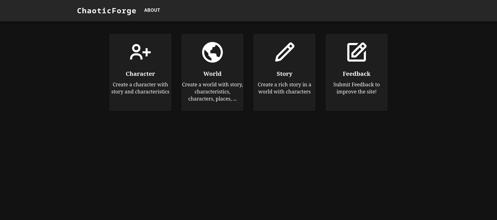

# ChaoticForge 

  

    
  

  
  

  ChaoticForge A website that offers a variety of creative generators to help writers, RPG players, and other storytellers bring their ideas to life.
  With character, name, and world generators, you can have insight's to create complex characters, imaginary worlds, and epic stories.
  

Access: https://chaoticforge.onrender.com/

# Home

# Libraries and tools used
- [Generators](https://github.com/izkeas/Generators)
- [React](https://github.com/facebook/react)
- [MaterialUI](https://mui.com/)
- [Express](https://expressjs.com/pt-br/)
- [FaunaDB](https://fauna.com/)
