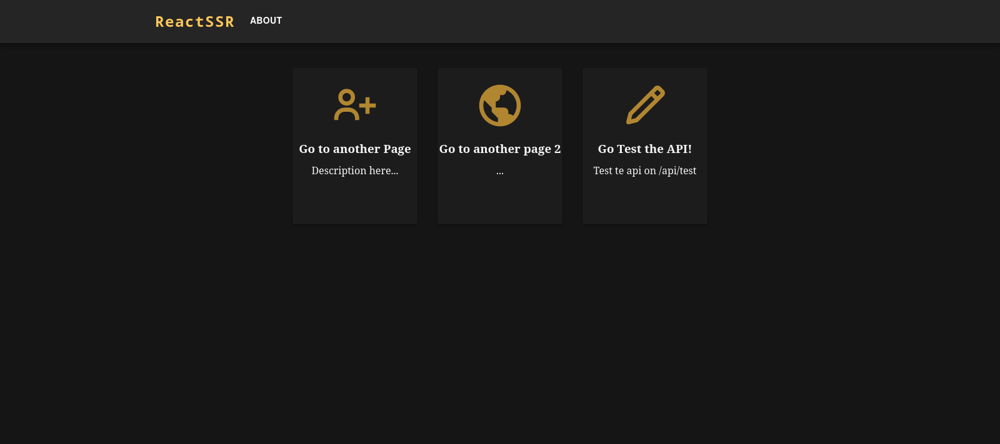

# ReactSSR

React Server Side Rendered with typescript, vite and MaterialUI!
Why do use this instead of NextJS? NextJS is a great framework for creating Serverless and stateless web applications, but not so good for creating an application that stores some kind of data on fast access RAM that lives for the entire application life cycle which in the most cases is not needed, but in some specific cases where the data needs to be processed and accessible to the entire application is needed an stateful application.

# Home

- All api routes are stored on `src/backend/api/`
- All site pages are stored on `src/frontend/pages/`
- Folder structure simple and concise

# Setup
- First install requirements with `yarn install`
- Then you can develop with `yarn dev`
- Then build with `yarn build`
- And start a web service with `yarn start`

# Libraries and tools used
- [React](https://github.com/facebook/react)
- [MaterialUI](https://mui.com/)
- [Express](https://expressjs.com/pt-br/)
